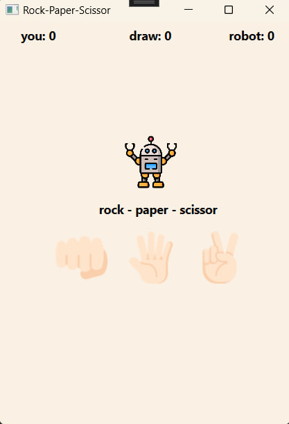
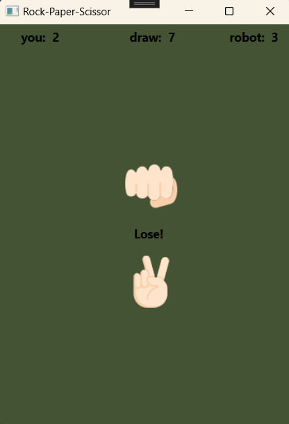

# README.md

This is the rock-paper-scissor game using WPF where XAML is a frontend language and C# is a backend languages.

https://www.instagram.com/deepistertalks/

- Inspired by the game of [deepistertalks]("https://www.instagram.com/deepistertalks/").
  
- Inspired by the game of <a href="(https://www.instagram.com/deepistertalks/)" title="page">deepistertalks</a>.

- Robot icon created by <a href="https://www.flaticon.com/free-icons/robot" title="robot icons">Freepik - Flaticon</a>.
  
- Fist (rock) icon made by [Smashicons](https://www.flaticon.com/authors/smashicons) from [www.flaticon.com](https://www.flaticon.com/).

- Five fingers (paper) icon made by [Freepik](https://www.freepik.com) from [www.flaticon.com](https://www.flaticon.com/).

- Victory (scissor) icon made by [ Vitaly Gorbachev](https://www.flaticon.com/authors/vitaly-gorbachev) from [www.flaticon.com](https://www.flaticon.com/).

- Color pallete from [Color Hunt](https://colorhunt.co/palette/faf1e4cedebd9eb384435334)
## Screenshots

## Authors

- [@Yasya12](https://github.com/Yasya12)

